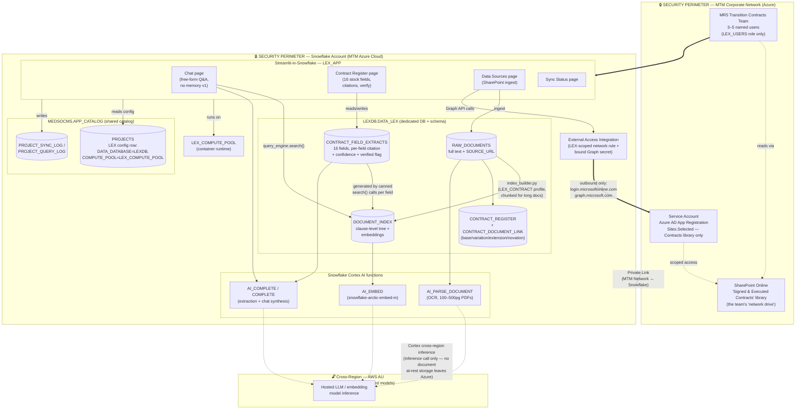

# LEX — Solution Architecture (Contextual View, One Page)

This is the "solution on a page" for LEX: users, Streamlit-in-Snowflake,
the Snowflake-internal data model, the external SharePoint connectivity,
and the security perimeter (MTM Azure network ↔ Snowflake over Private
Link, plus cross-region Cortex inference to AWS AU).

A polished visual version of this same diagram is published at:
https://claude.ai/code/artifact/ef0664c5-268e-42b8-ab4e-553e9cbb785d

## Legend / notes

- **Solid arrows** = data/document flow inside a trust boundary. **Dashed
  arrows** = cross-boundary calls (SharePoint reach-in via EAI, or
  cross-region Cortex inference).
- **Two nested security perimeters** are drawn deliberately:
  1. **MTM Corporate Network** — where the users and the SharePoint source
     of truth live.
  2. **Snowflake Account (MTM Azure Cloud)** — where all contract text,
     the index, and the extracted fields are actually stored and queried.
     The only thing crossing *into* this perimeter from outside is the
     Private Link connection from MTM's network, and the only thing
     crossing *out* is the EAI's narrowly-scoped outbound call to Graph
     (to pull documents in) — never a path for documents to leave
     Snowflake.
- **Cross-region AWS AU is not a data-at-rest boundary** — it's Snowflake
  Cortex's own hosted-model inference path (why the account has
  cross-region inference enabled at all: some Cortex functions/models
  used here aren't hosted in every region). Contract text is sent for
  inference, not stored there. Called out as its own box because it's the
  one place text technically leaves the Azure account boundary, even
  transiently — see `PLAN.md` §13, open question 5, for the compliance
  confirmation this should get before real signed contracts flow through
  it.
- **Access restriction to 3–5 users** happens at the `LEX_USERS` role grant
  (on the Streamlit app, `LEXDB`, `LEX_COMPUTE_POOL`, and the query
  warehouse) — drawn as the boundary around `USERS ⇒ APP`, not a separate
  box, since it's a grant, not a network control.
- Full field-by-field detail (what each `DATA_LEX` table holds, why the
  16 stock fields are generated via canned `search()` calls rather than a
  bespoke extraction prompt, and the chunked-indexing fix needed for
  500-page documents) is in `PLAN.md` §4–§6.
